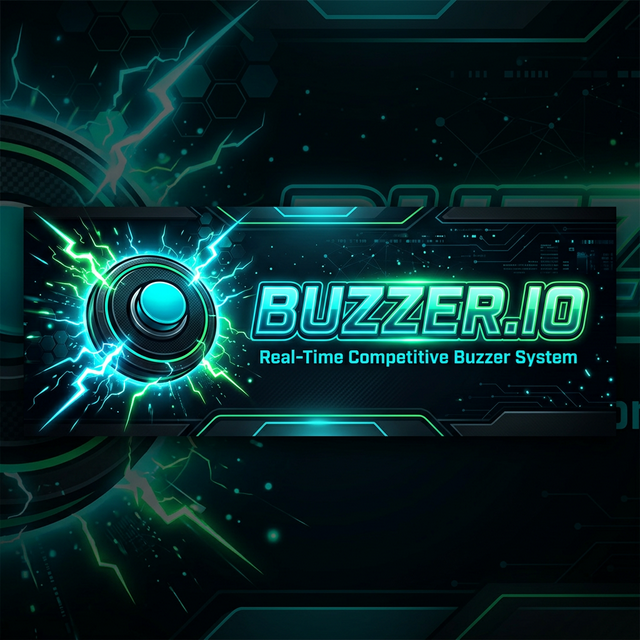
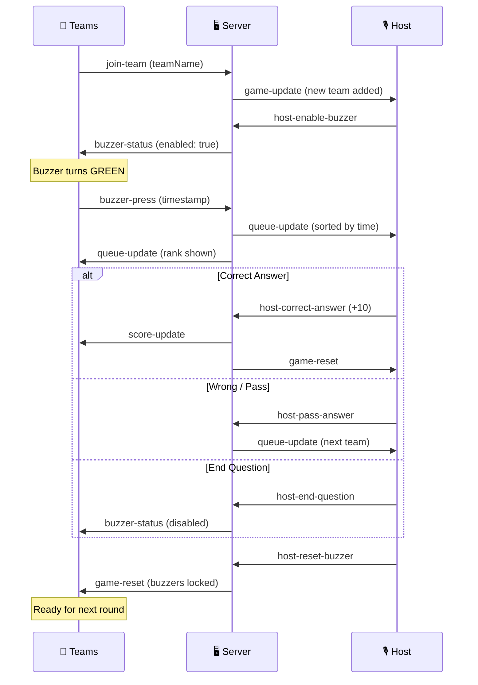

<p align="center">
  
</p>

<h1 align="center">⚡ BUZZER.IO</h1>

<p align="center">
  <strong>A real-time competitive buzzer system built for quiz nights, trivia events, and classroom competitions.</strong>
</p>

<p align="center">
  
  
  
  
  
</p>

<p align="center">
  
  
  
</p>

---

## 🎯 What is BUZZER.IO?

BUZZER.IO is a **millisecond-accurate, real-time buzzer system** designed for competitive events. A host controls the game flow while teams compete to buzz in first — with a live queue ranked by reaction time, score tracking, and a public leaderboard.

Think of it as a **digital version of the buzzer systems used in TV quiz shows**, accessible from any browser on any device.

---

## ✨ Features

### 🎮 Host Dashboard
- **PIN-protected access** (password: `ADMIN2025`) via navbar modal
- **Enable / Disable buzzer** with one click
- **Live buzzer queue** showing teams ranked by reaction time (millisecond precision)
- **Correct (+10 pts)** / **Wrong-Pass** / **End Question (No Points)** controls
- **Real-time score panel** with all connected teams
- **Reset Round / Next Question** — clears the queue and re-locks all buzzers
- **Team join link** and **leaderboard link** displayed for easy sharing
- **Auto-resets** stale buzzer state on dashboard load

### 🔴 Team Buzzer
- **Join with team name** — no account required
- **Animated buzzer button** with 4 visual states:
  - 🔒 **Locked** (grey) — waiting for host to enable
  - 🟢 **Ready** (green pulse) — buzzer is hot, press now!
  - 🔵 **Active** (blue glow) — you're #1 in queue, answering
  - 🟡 **Standby** (yellow) — buzzed in, waiting your turn with rank displayed
- **Connection status indicator** — shows "CONNECTING..." if backend is unreachable
- **Framer Motion animations** for smooth state transitions

### 📊 Public Leaderboard
- **Live-updating scores** — no refresh needed
- **Ranked display** with team positions
- **Accessible to anyone** — share the link with the audience

### 🧭 Navigation Bar
- **BUZZER.IO** logo linking to home
- **BUZZER** (green) — team join page
- **LEADERBOARD** (yellow) — public scoreboard
- **HOST** (blue) — opens inline PIN modal for authenticated access
- Active route highlighting with color-coded indicators

### 🔐 Access Control
- Teams can **only access the Buzzer page**
- Clicking **HOST** triggers a PIN modal — wrong PIN shows "Access denied"
- Host dashboard is **never directly accessible** without correct PIN
- PIN gate lives in the navbar, not the route — clean UX

---

## 🏗️ Architecture

```
┌─────────────────────────────────────────────────────────┐
│                     BUZZER.IO                           │
├─────────────────────┬───────────────────────────────────┤
│      Frontend       │           Backend                 │
│   (Vercel - React)  │       (Render - Node.js)          │
│                     │                                   │
│  ┌──────────────┐   │   ┌─────────────────────────┐     │
│  │   Home.jsx   │   │   │      server.js           │     │
│  │  (Team Join) │   │   │  Express + Socket.IO     │     │
│  └──────┬───────┘   │   └────────────┬────────────┘     │
│         │           │                │                  │
│  ┌──────▼───────┐   │   ┌────────────▼────────────┐     │
│  │TeamBuzzer.jsx│◄──┼──►│  socketHandlers.js       │     │
│  │  (Buzzer UI) │   │   │  • join-team             │     │
│  └──────────────┘  WS   │  • buzzer-press          │     │
│                     │   │  • host-enable/disable   │     │
│  ┌──────────────┐   │   │  • host-correct/pass     │     │
│  │HostDashboard │◄──┼──►│  • host-reset-buzzer     │     │
│  │  (Host UI)   │   │   │  • host-end-question     │     │
│  └──────────────┘   │   └────────────┬────────────┘     │
│                     │                │                  │
│  ┌──────────────┐   │   ┌────────────▼────────────┐     │
│  │Leaderboard   │◄──┼──►│    gameState.js          │     │
│  │ (Scores)     │   │   │  (in-memory state)       │     │
│  └──────────────┘   │   └─────────────────────────┘     │
└─────────────────────┴───────────────────────────────────┘
```

---

## 📁 Project Structure

```
Buzzer-App/
├── backend/
│   ├── server.js              # Express + Socket.IO server
│   ├── socketHandlers.js      # All real-time event handlers
│   ├── gameState.js           # In-memory game state management
│   ├── railway.json           # Railway deployment config
│   ├── utils/
│   │   ├── timestampQueue.js  # Millisecond-precision queue sorting
│   │   └── scoring.js         # Score calculation logic
│   └── package.json
│
├── frontend/
│   ├── src/
│   │   ├── pages/
│   │   │   ├── Home.jsx           # Team join landing page
│   │   │   ├── TeamBuzzer.jsx     # Buzzer interface for teams
│   │   │   ├── HostDashboard.jsx  # Host control panel
│   │   │   └── Leaderboard.jsx    # Public scoreboard
│   │   ├── components/
│   │   │   ├── BuzzerButton.jsx   # Animated buzzer with 4 states
│   │   │   ├── Navbar.jsx         # Navigation + PIN modal
│   │   │   ├── QueueDisplay.jsx   # Real-time buzzer queue
│   │   │   └── ScoreTable.jsx     # Leaderboard table
│   │   ├── socket.js              # Socket.IO client config
│   │   ├── App.jsx                # Router + layout
│   │   └── index.css              # Cyber theme + Tailwind
│   ├── vercel.json                # Vercel SPA config
│   └── package.json
│
├── render.yaml                    # Render deployment config
├── Procfile                       # Heroku-compatible start command
├── package.json                   # Monorepo root (postinstall)
└── README.md
```

---

## 🚀 Quick Start

### Prerequisites
- **Node.js** ≥ 18.0.0
- **npm** ≥ 9.0.0

### Local Development

```bash
# 1. Clone the repo
git clone https://github.com/Sjking2025/Buzzer-App.git
cd Buzzer-App

# 2. Start the backend
cd backend
npm install
npm run dev          # Runs on http://localhost:3000

# 3. Start the frontend (new terminal)
cd frontend
npm install
npm run dev          # Runs on http://localhost:5173
```

### 🧪 Testing Locally

1. Open `http://localhost:5173` — enter a team name → Join
2. Open a new tab → `http://localhost:5173` → join as another team
3. Navigate to HOST via the navbar → enter PIN `ADMIN2025`
4. Click **ENABLE** → team buzzers turn green
5. Buzz in from team tabs → watch the queue populate on the host dashboard
6. Use **CORRECT** / **WRONG** / **END QUESTION** to control the flow
7. Check the **Leaderboard** page for live scores

---

## 🌐 Deployment

### Backend → [Render](https://render.com) (Free Tier)

| Setting | Value |
|---------|-------|
| **Root Directory** | `backend` |
| **Build Command** | `npm install` |
| **Start Command** | `node server.js` |
| **Instance Type** | Free |

### Frontend → [Vercel](https://vercel.com) (Free Tier)

| Setting | Value |
|---------|-------|
| **Root Directory** | `frontend` |
| **Build Command** | `npm install && npm run build` |
| **Output Directory** | `dist` |
| **Framework Preset** | Vite |

### Environment Variables

| Platform | Variable | Value |
|----------|----------|-------|
| **Vercel** | `VITE_BACKEND_URL` | `https://your-backend.onrender.com` |

> ⚠️ `VITE_BACKEND_URL` is baked in at **build time**. You must redeploy Vercel after changing it.

> 💡 Render's free tier sleeps after 15 min of inactivity. First request takes ~10-20s to wake up. Open the host dashboard before your event starts.

---

## 🔌 Socket.IO Events

### Client → Server

| Event | Payload | Description |
|-------|---------|-------------|
| `join-team` | `{ teamName }` | Register a new team |
| `buzzer-press` | `{ clientTimestamp }` | Team buzzes in |
| `host-enable-buzzer` | — | Unlock all buzzers |
| `host-disable-buzzer` | — | Lock all buzzers |
| `host-reset-buzzer` | — | Clear queue + lock buzzers |
| `host-correct-answer` | `{ points }` | Award points to active team |
| `host-pass-answer` | — | Skip to next team in queue |
| `host-end-question` | — | End question, no points |
| `get-game-state` | — | Request full game state |

### Server → Client

| Event | Payload | Description |
|-------|---------|-------------|
| `buzzer-status` | `{ enabled }` | Buzzer lock/unlock state |
| `queue-update` | `[{ name, time }]` | Updated buzzer queue |
| `game-update` | `{ teams, buzzerQueue, ... }` | Full game state |
| `score-update` | `{ teams }` | Updated scores |
| `game-reset` | — | Round reset signal |

---

## 🎨 Design System

BUZZER.IO uses a custom **Cyber** theme built on Tailwind CSS v4:

| Token | Color | Usage |
|-------|-------|-------|
| `cyber-black` | `#0a0a0a` | Page backgrounds |
| `cyber-dark` | `#121212` | Section backgrounds |
| `cyber-gray` | `#1f1f1f` | Cards, panels |
| `cyber-neonGreen` | `#00ff9d` | Success, active states, scores |
| `cyber-neonRed` | `#ff0055` | Errors, disable button |
| `cyber-neonBlue` | `#00ccff` | Active buzzer, host highlights |
| `cyber-neonYellow` | `#fcee0a` | Standby, leaderboard |

**Fonts:** JetBrains Mono (monospace) + Rajdhani (sans-serif)

---

## 🛠️ Tech Stack

| Layer | Technology | Version |
|-------|-----------|---------|
| **Frontend** | React | 19.2 |
| **Bundler** | Vite | 7.3 |
| **Styling** | Tailwind CSS | 4.1 |
| **Animations** | Framer Motion | 12.34 |
| **Icons** | Lucide React | 0.564 |
| **Routing** | React Router | 7.13 |
| **Real-time** | Socket.IO Client | 4.8 |
| **Backend** | Express | 5.2 |
| **WebSocket** | Socket.IO | 4.8 |
| **Frontend Hosting** | Vercel | — |
| **Backend Hosting** | Render | — |

---

## 📊 Game Flow



---

## 👤 Author

**Sjking2025** — [GitHub](https://github.com/Sjking2025)

---

<p align="center">
  <strong>Built with ⚡ for speed. Designed for competition.</strong>
</p>
